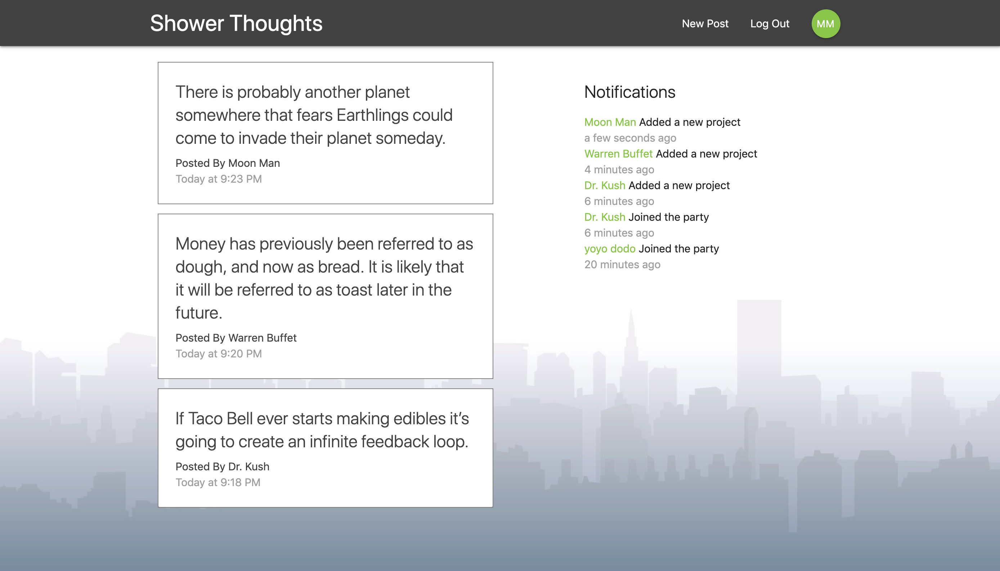

<h2>Getting Started</h2> 
(this project uses react and firebase) 

•	Clone this repo  
•	npm install to install all req'd dependencies  
•	Go to firebase and create a new project. Copy the new project’s API key and replace it with the API key under ./src/config/fbConfig  
•	Inside your firebase project database, create the follow collections: 'projects', 'users', 'notifications'  
•	Inside the collection ‘projects’, creating the following fields: string-‘authorFirstName’, string-‘authorLastName’, string-‘authorId’, string-‘content’, string-‘title’, string-‘createdAt’  
•	Inside the collection ‘users’, creating the following fields: string-‘firstName’, string-‘lastName’, string-‘initials’  
•	Inside the collection ‘notifications’, creating the following fields: string-‘user’, string-‘content’, string-‘time’  
•	Inside the repo's main directory, copy the code inside firestore.rules and paste it inside firebase-database-‘rules’  
•	npm start to start the local server 

You can checkout the live preview of this project here -> https://shower-thoughts1.firebaseapp.com/signin

